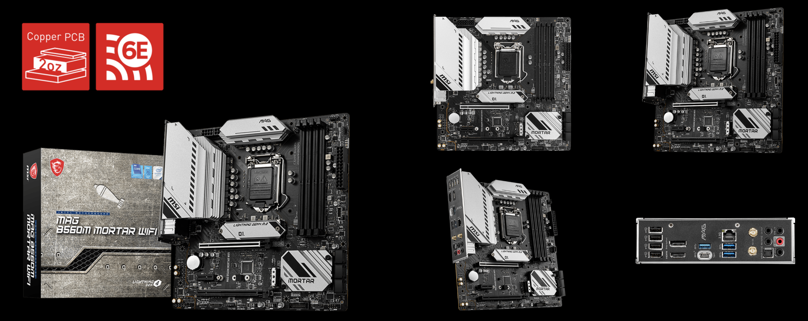
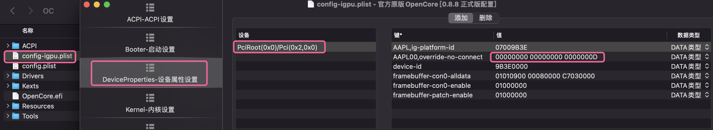
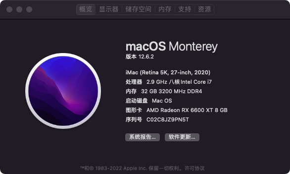
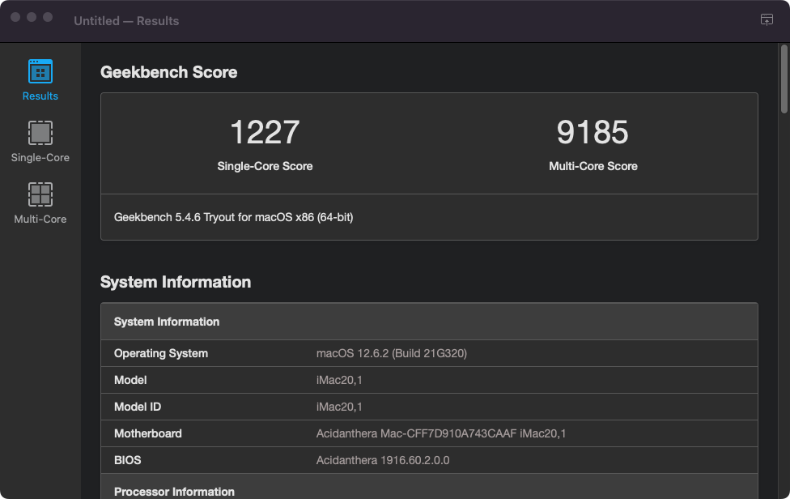
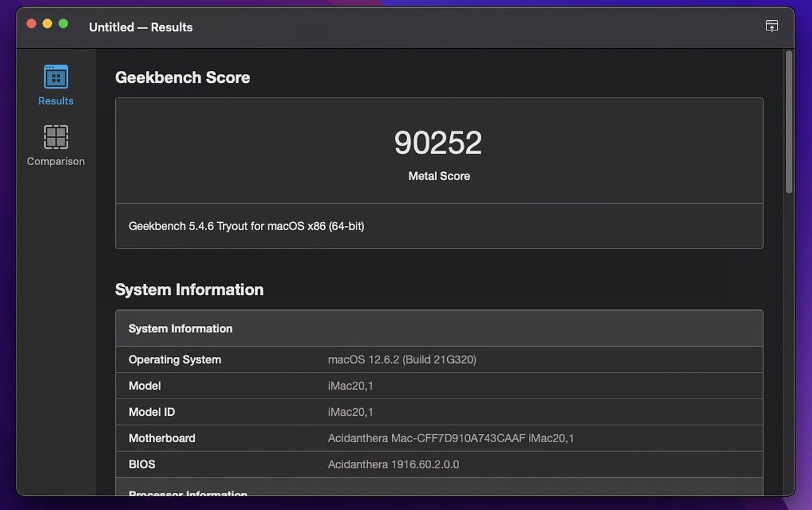
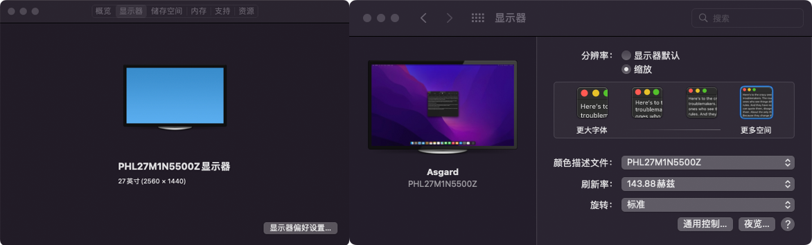

# MSI-MAG-B560M-MORTAR-WIFI Hackintosh OpenCore EFI

### [简体中文](README.zh_CN.md)

### OpenCore

[OpenCore 0.8.8](https://github.com/acidanthera/OpenCorePkg)

### OS Version Tested

- macOS Monterey 12.x
- macOS Ventura  13.x 

### Hardware

- Motherboard:MSI-MAG-B560M-MORTAR-WIFI
- Bios Version: 7D17v1B（2022-11-29）
- CPU: Intel i7-10700
- RAM: KINGSTON FURY 32GB(16G*2) DDR4 3200MHz
- SSD: KIOXIA 500GB EXCERIA PLUS G2 NVMe RD20 MacOS
- iGPU: Intel UHD630
- GPU: ASRock RX6600XT Challenger Pro 8GB OC
- Audio: Realtek ALC897
- Ethernet: Realtek 8125 PCle 2.5GbE Family Controller
- Wireless: BCM94352Z (Replace Intel AX210)
- CPU Cooling：Thermalright AK120
- Display: Philips 27M1N5500Z 2K 170hz NanoIPS1ms(GtG) 98%P3 
- PSU: NZXT HALE82 V2S 750W
- CASE: NZXT Tempest 410

### Bios Setup

| Name | Option |
| ----- | --- |

### Notes

 - Use [OpenCore Configurator](https://mackie100projects.altervista.org/opencore-configurator/) build your own SMBIOS
 
 - When u only use 10th CPU UHD630 on MSI-MAG-B560M-MORTAR with HDMI 
[500Series With 10th CPU UHD630 in Macos](https://www.bilibili.com/video/BV1UW4y1J7J2/)

 - 1.Please use config-igpu.plist(rename config.plist)
 - 2.search montior EDID in Windows
 - 3.U must insert your montior EDID in config.plist DeveciProperties -- PciRoot(0x0)/Pci(0x2,0x0) -- AAPL00,override-no-connect -- 00000000 00000000 00000000 （replace this）
 

 
### ScreenShot 

- About This Mac

- Geekbench5 Score i7-10700 

- Geekbench5 Score Metal ASRock RX6600XT Challenger Pro 8GB OC

- Philips 27M1N5500Z

- NZXT Tempest 410

